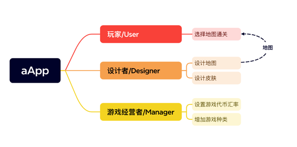
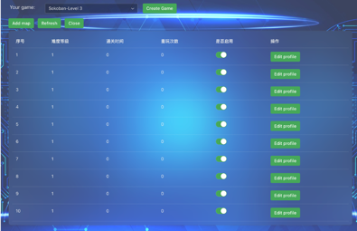
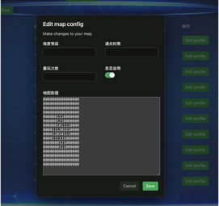
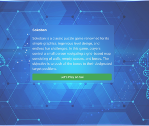
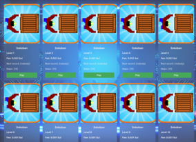
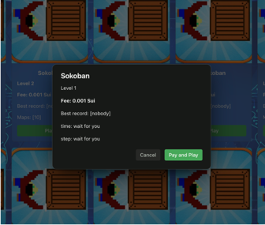
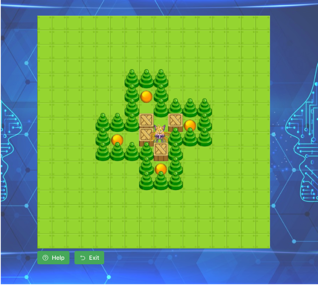

# SuiPlayground
SuiPlayground是一款建立在区块链上的一个智能合约游戏资源管理平台。SuiPlayground通过智能合约来管理游戏资源和游戏玩家的资产，以简单易用的界面为游戏玩家和游戏开发者提供服务。

在SuiPlaygroud平台上有三种角色：

- 游戏运营者
- 游戏开发者
- 游戏玩家

其中游戏运营者负责部署游戏主合约，同时推广游戏前端页面给游戏开发者和游戏玩家；游戏开发者负责设计游戏逻辑、游戏UI资源；游戏玩家在游戏运营者部署的Web 3.0应用上选择游戏进行玩耍，并支付费用给游戏开发者。

## 项目现状

当前平台已经完成设计和部署推箱子（Sokoban）这款经典的益智解谜游戏。推箱子（Sokoban）以简洁的的画面、巧妙的关卡设计和无尽的挑战乐趣而闻名于世。

在这个游戏中，玩家需要控制一个角色在由墙壁、空地和箱子组成的网格地图上移动，目标是将所有的箱子推动到指定的目标位置。

SuiPlaygroud平台分别提供两个Web3.0应用给游戏设计者和游戏玩家。

- 游戏管理端：游戏设计者通过Web3.0应用可以完成游戏的设计，定价和发布。

- 玩家端：游戏玩家通过Web3.0应用选择不同的地图集参与游戏。游戏玩家每选择一套地图需要支付0.01 Sui给游戏设计者。

## 界面展示

## 游戏管理端 [demo](https://croal99.github.io/push-box/push-box/dist/admin/)

### 游戏管理列表
* 不同的开发者只能管理自己游戏数据

### 游戏数据维护

## 玩家端 

### 用户登录

### 游戏广场

### Pay for game

### Play Sokoban Game

## Demo website
[玩家端](https://croal99.github.io/push-box/push-box/dist/)
[管理端](https://croal99.github.io/push-box/push-box/dist/admin/)